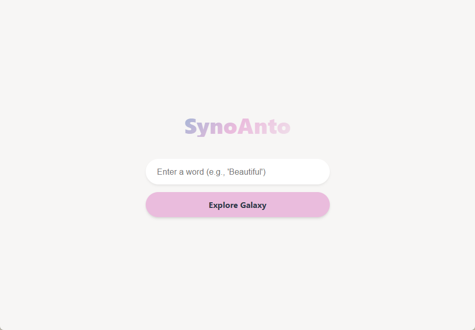
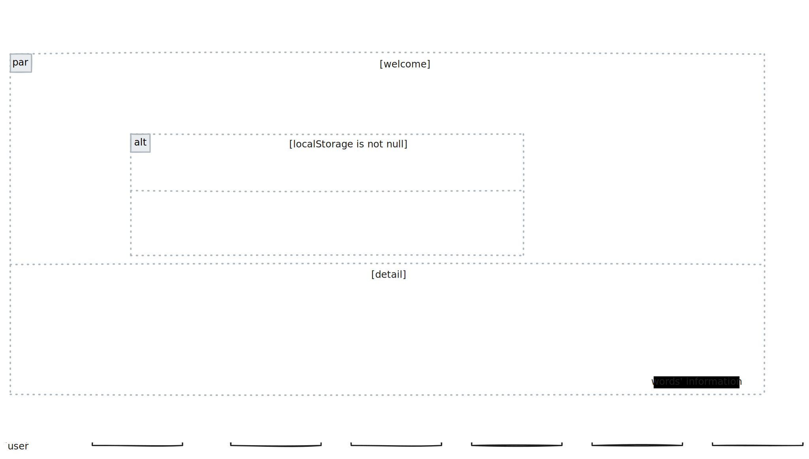

  
  <h1>SynoAnto</h1>
  
一个专注于近/反义词的英语学习工具

  

## 设计方案
✨产品亮点：目前大模型软件已经可以支持很多英语学习的功能，但是它接受的信息很杂，没有针对性的学习记忆功能，所以可以借助大模型能力，打造一款专注于近义词/反义词的英语学习app，列出近义词/反义词的词义，词源，词用，词例，词义对比，词源脉络等信息，帮助用户更好地学习英语。另外，根据用户的学习习惯，总结使用场景，推荐可能用到的其他单词。

支持功能：
- 单词释义查询（中/英文）
- 近义/反义词查询
- 云图展示单词关系
- 词义对比
- 词频统计展示
- 当前哪些地区的人也在搜索同一单词

后续：
- 英语学习社群，根据不同场景及话题建立聊天组，减少破冰尴尬
- AI文本对话
- 拍图识词
- 记忆功能（学习过的单词保存到个人词库中，和新单词一起学习，记录上次查询时间和使用场景）
- ios版本
- 专业名词查询（区分行业，eg.计算机行业，金融行业等）

milestone
- 搭建web端雏形，完成UI设计及基本功能 2025/12/24
- 开始搭建后端服务，用于管理词典数据源、词频统计以及用户信息等功能 2026/01/08
- 部署上线 2026/01/10